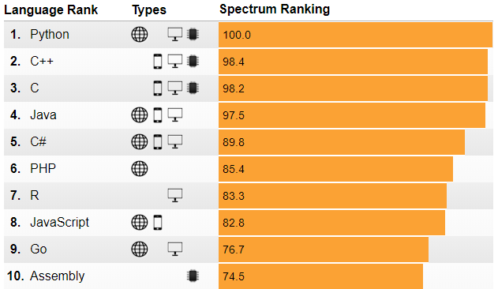

```{r setup, include=FALSE}
options(htmltools.dir.version = FALSE)
```

# Plan szkolenia

1. Środowisko pracy - R

--

2. Segmentacja klientów

--

3. Metoda k-średnich

--

4. Case study w R

---
class: inverse, center, middle

# Why R?

---

# R to możliwości

Środowisko do obliczeń statystycznych i wizualizacji wyników.

- darmowy

--

- prawie 13 000 rozszerzeń (pakietów)

--

- wsparcie społeczności

--

- wszechstronny

--

   - obliczenia i wizualizacje
   - raporty
   - interaktywne dashboardy
   - strony internetowe
   - prezentacje
   - mapy
   - ...

---

# R to język do analizy danych

IEEE Language Rankings 2018

<center></center>

11 - Matlab, 24 - SQL, 32 - Julia, 40 - SAS

[http://blog.revolutionanalytics.com/2018/08/ieee-language-rankings-2018.html](http://blog.revolutionanalytics.com/2018/08/ieee-language-rankings-2018.html)

---

# R to program

Do pobrania ze strony: [R-project](https://www.r-project.org/)

<center></center>

---

# RStudio to wygoda

Do pobrania ze strony: [RStudio](https://www.rstudio.com/)

<center></center>

---

# Materiały do zajęć

1. Wejdź na stronę: [https://github.com/lwawrowski/cdv_kmeans](https://github.com/lwawrowski/cdv_kmeans)
2. Kliknij zielony przycisk __Clone or download__ i skopiuj link
3. Otwórz RStudio
4. W prawym górnym roku wybierz __New project__, a następnie __Version control__
5. W kolejnym kroku wybierz pozycję __Git__ i wklej skopiowany link
6. Kliknij przycisk __Create project__

---

# Struktura projektu

- data - katalog z danymi
   - klienci.csv
   - zywoploty.xlsx
- img - grafiki z prezentacji
- libs - bibilioteki do prezentacji
- prezentacja.html - plik wynikowy prezentacji
- prezentacja.Rmd - plik źródłowy prezentacji
- 01_skrypt.R - program w R
- 02_raport.Rmd - raport w R
- 03_segementacja.Rmd - case study

---

# R jako kalkulator

Proszę otworzyć plik __01_skrypt.R__

---

# Funkcje w R

R jest wrażliwy na wielkość liter.

```{r}
sqrt(25)
```

```{r, error=TRUE}
SQRT(25)
```

Zatem do pierwiastkowania wykorzystamy funkcję z pierwszego przykładu.

---

# Przechowywanie danych

Do R można wczytać dane z dowolnego źródła, ale podstawowym elementem każdego obiektu jest wektor.

Wektor tworzy się z wykorzystaniem funkcji `c()`.

Wektor zawierający oceny ze studiów:

```{r}
c(5,5,4,4.5,3.5,5,6)
```

Policzmy średnią:

```{r}
oceny <- c(5,5,4,4.5,3.5,5,6)
mean(oceny)
```

---

# Zadanie nr 1 (5 min)

Dla wcześniej zdefiniowanych ocen oblicz medianę.

--

_Wskazówka:_

Korzystając z google zapytanie najlepiej formułować w następujący sposób:

_r calculate mean_

---

# R jako narzędzie do raportowania

Połączenie języka __R__ i __markdown__ umożliwia tworzenie dynamicznych raportów, które można eksportować do plików:

- html,
- pdf (potrzebny [MiKTeX](https://miktex.org/)),
- docx.

Zajrzyjmy do pliku __02_raport.Rmd__

---

# Markdown - tekst

Większość raportu będzie stanowił zwykły tekst.

.pull-left[
__Kod__
```
To jest zwykły tekst.
_Kursywa_ i __pogrubienie__.
Enter nie wystarczy, żeby przejść  
do nowej linii - trzeba wstawić  
co najmniej __dwie spacje__.
```
]
.pull-right[
__Wynik__   
  
To jest zwykły tekst.  
_Kursywa_ i __pogrubienie__.  
Enter nie wystarczy, żeby przejść  
do nowej linii - trzeba wstawić  
co najmniej __dwie spacje__.
]

---

# Nagłówki

Struktura dokumentu definiowa jest przez nagłówki.

__Kod__
```
# Nagłówek pierwszego stopnia
## Nagłówek drugiego stopnia
### Nagłówek trzeciego stopnia
```

__Wynik__   
   
# Nagłówek pierwszego stopnia
## Nagłówek drugiego stopnia
### Nagłówek trzeciego stopnia

---
# Listy

.pull-left[
__Kod__
```
1. Pozycja 1
2. Pozycja 2
3. Pozycja 3
    - Pozycja 3a
    - Pozycja 3b
```
]
.pull-right[
__Wynik__   
   
1. Pozycja 1
2. Pozycja 2
3. Pozycja 3
    - Pozycja 3a
    - Pozycja 3b

]

---

# Linki

Adresy stron internetowych automatycznie zamieniają się na linki. Można też stworzyć tekst, który będzie prowadził do strony.

__Kod__
```
https://cdv.pl/

[Collegium Da Vinci](https://cdv.pl/)
```

__Wynik__   
   
https://cdv.pl/

[Collegium Da Vinci](https://cdv.pl/)

---

# Zadanie nr 2 (10 min)

1. Zaokrąglij średnią długość żywopłotów w miastach do dwóch miejsc po przecinku.

2. Przedstaw zmianę długości żywopłotów na wsi z wykorzystaniem wykresu liniowego.

---
class: inverse, center, middle

# Segmentacja 

---

# Segmentacja

Segmentacja/grupowanie/klasteryzacja/klasyfikacja czyli:

podział zbioru obiektów na grupy obiektów podobnych. 

W rezultacie:

- obiekty znajdujące się w tym samym segmencie powinny być do siebie podobne,
- obiekty znajdujące się w różnych segmentach powinny się od siebie różnić.

---

# Idea

<center></center>

---

# Etapy segmentacji

- sformułowanie celu analizy
- dobór cech
- wybór metody segmentacji
- przeprowadzenie segmentacji
- weryfikacja wyników
- interpretacja wyników

---

# Podobieństwo obiektów

W statystyce miarą podobieństwa jest metryka np. euklidesowa lub miejska.

Stosowanie metryk wymaga zapewnienia porównywalności różnych cech poprzez zastosowanie np. standaryzacji.

Standaryzacja pozbawia cechy jednostek, w jakich są mierzone - ustalając średnią równą 0 i odchylenie standardowe równe 1.

---

# Metoda k-średnich

Najpopularniejsza metoda grupowania obiektów, która efektywnie działa zarówno na małych, jak i dużych zbiorach.

Wymaga zadeklarowania końcowej liczby segmentów.

__Algorytm__

1. Określ liczbę grup - $k$
2. Dla każdej grupy ustal wyjściowy centroid
3. Przypisz każdy obiekt do najbliższego centroidu
4. Na podstawie przypisanych obiektów oblicz nowe współrzędne centroidu
5. Sprawdź czy każdy obiekt przypisany jest do najbliższego centroidu
6. Jeśli nie to zmień przypisanie obiektu do centrodu
7. Jeśli nie obserwuje się żadnych przesunięć to algorytm się kończy

---

# Ustalanie liczby grup

W metodzie k-średnich należy podać docelową liczbę skupień. Możemy spróbować ustalić tą wartość na podstawie wykresu osypiska (ang. _elbow method_).

<center></center>

Wybieramy liczbę skupień po której nie następuje już gwałtowny spadek wartości wariancji wewnątrz-grupowej.

---

# Segmentacja klientów

Bierzemy na warsztat plik __03_segmentacja.Rmd__

---

# Zadanie nr 3 (15 min)

1. Ile wynosi średnia i odchylenie standardowe cech w zbiorze `cechy_z`?

2. Zestaw ze sobą na wykresie roczny dochód, wskaźnik wydatków oraz segment.

3. Usuń z analizy zmienną wiek - jaka jest optymalna liczba segmentów?


---
class: inverse, center, middle

# Pytania? 


